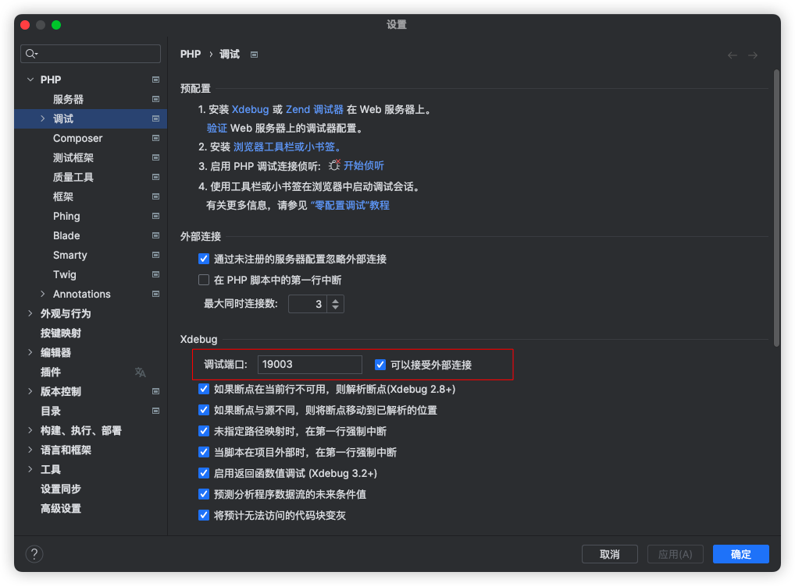
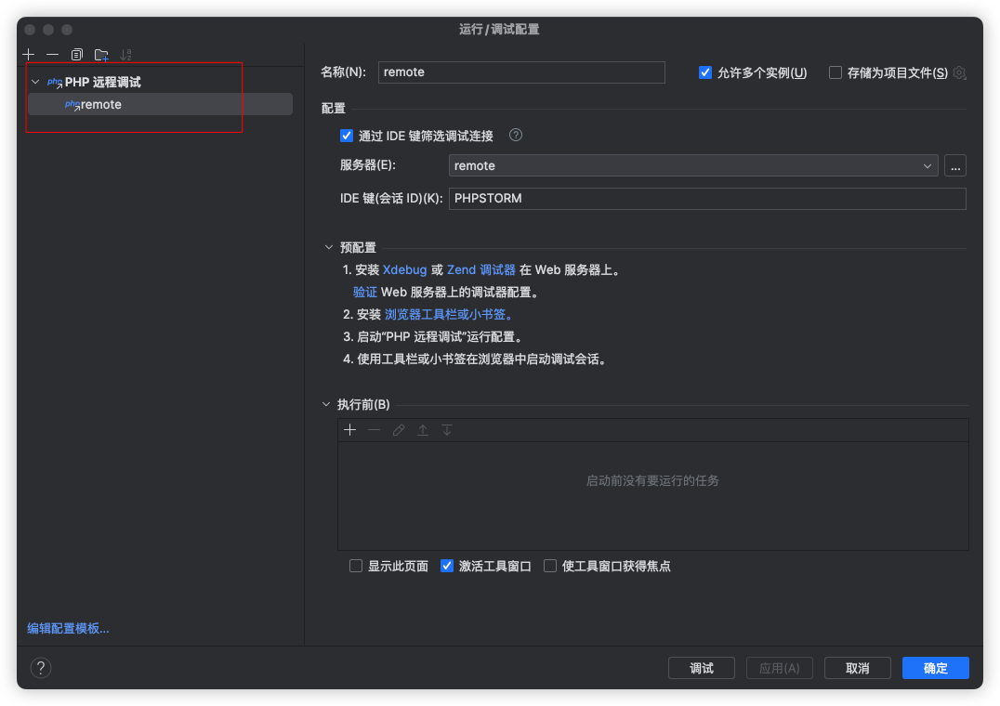
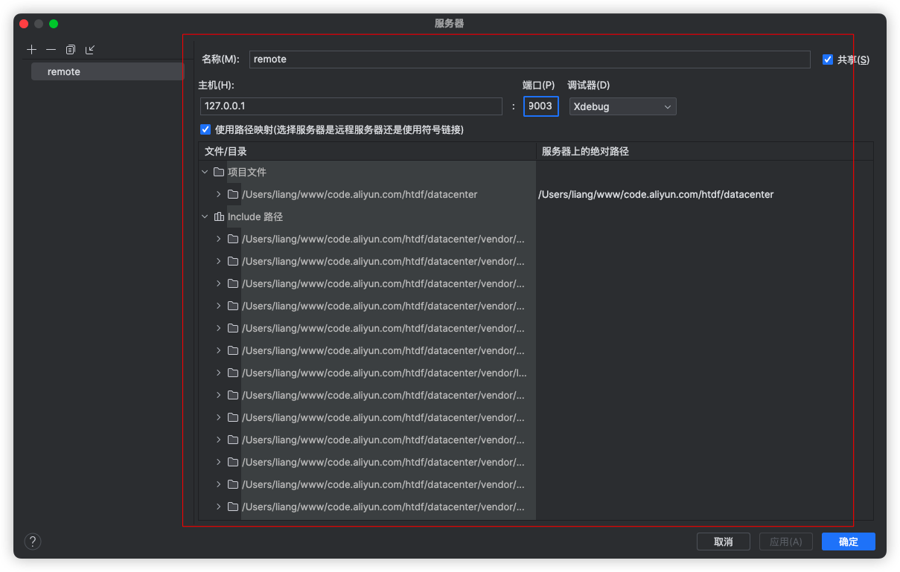
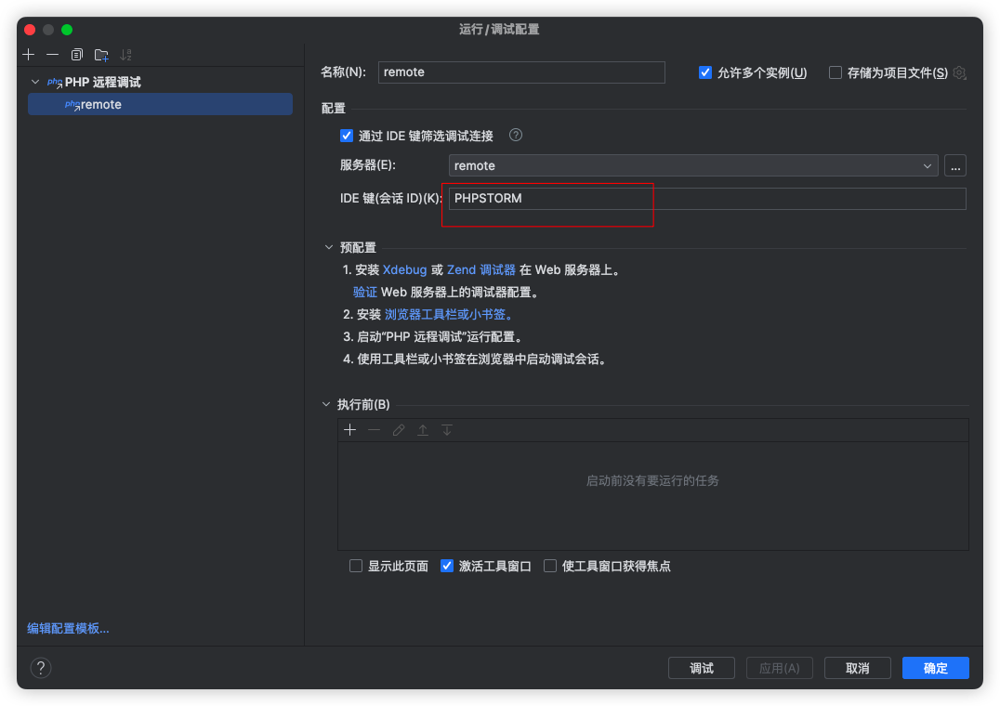
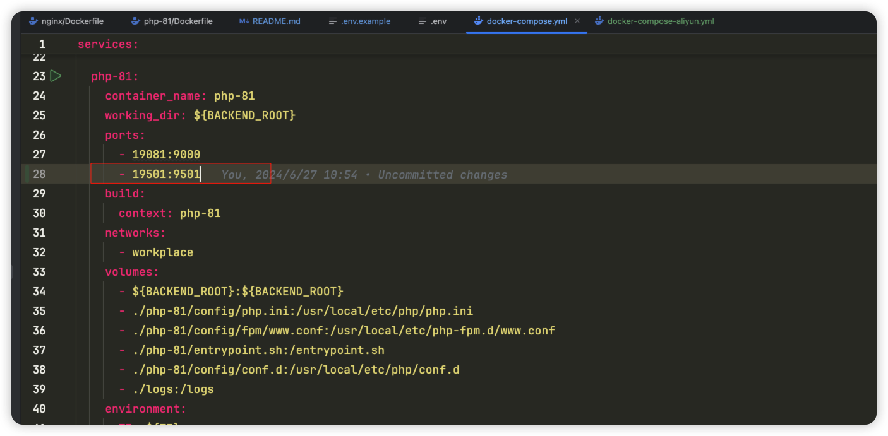

[TOC]

# 本地开发docker-compose配置

# 说明
.env 文件遍历并未完全使用

# phpstorm Xdebug 设置步骤
1. 设置 -> PHP -> 调试 -> 调试端口(可监听多个，使用,号分隔)

2. 添加远程调试

3. 添加服务器

4. 配置 Xdebug key

# 直接使用远程镜像
1. 修改 `docker-compose.yml` 文件为 `docker-compose.yml.bak`

2. 修改 `docker-compose-aliyun.yml` 文件为 `docker-compose.yml`

3. 复制 `.env.example` 为 `.env`，并修改内容
   BACKEND_ROOT=你的php代码根路径，如 `/Users/liang/www`，docker构建后，会将该路径挂载到容器内

4. 执行 `docker-compose up -d`

# 增加端口监听
1. 使用hyperf开发的同学，如需要再宿主机调试，则需要将hyperf端口暴露出来

2. 修改 `docker-compose.yml` 文件，在你运行hyperf框架的容器下，增加端口映射，将9501映射到宿主机的19501端口，如图
   

3. 在宿主机访问 127.0.0.1:19501 即可访问到hyperf框架